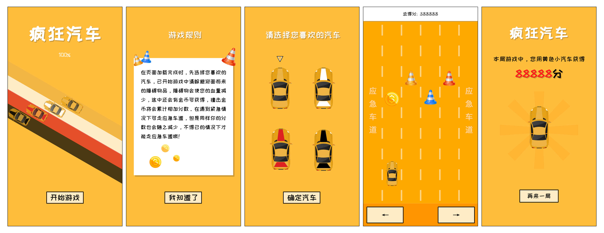

# pixi.js game 《crazy car》

pixi.js 游戏之 《疯狂汽车》

## 游戏在线地址
游戏链接 → [点击打开](https://zion0707.github.io/pixijs_game_crazy_car/index.html "疯狂汽车") 

游戏二维码 ↓  

## 游戏相关截图

## 游戏规则
通过点击游戏界面中的左右按钮，或通过键盘的的左右键点击，进行对障碍物的躲避，必要的时候可以通过在应急车道上进行躲避，但会消耗总分。撞击金币得到相应的总分加成，获得的总分越多即排名越靠前。

## 游戏介绍
**疯狂汽车** 是使用 **pixi.js** 框架，进行开发的一款H5小游戏。

## 游戏注意事项
由于只是学习pixi.js游戏开发，在制作的过程中，没有在元素中添加过多的动画效果，及没有做过多的适配兼容，所以请调整到【宽375px * 高720px】的界面上预览最佳 ^_^。

## 游戏开发人员

**策划：** Zion

**美工：** Zion

**开发：** Zion

